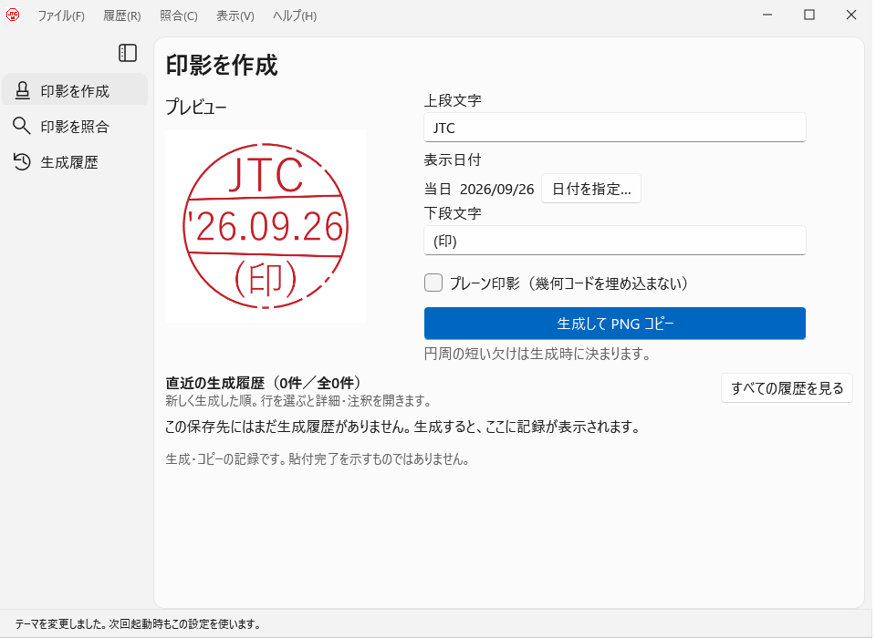
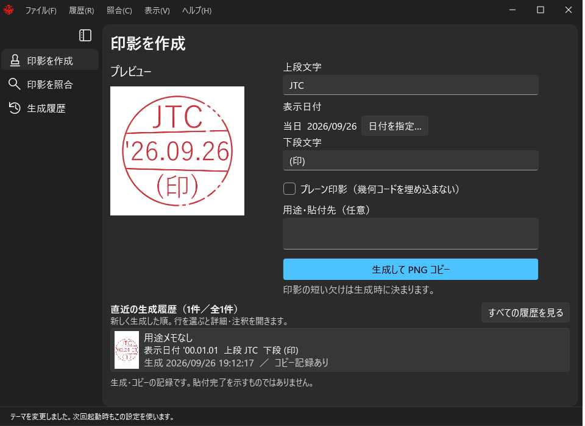

# JTC Stamper — Windows用の日付印・電子印鑑アプリ

**日付印を作って貼る。用途も、作った記録も残す。**

氏名や部署名を入れた日付印（デート印）を作り、透過PNGとしてWord・Excel・PowerPointへ貼り付けられる、無料・オープンソースのWindows用電子印鑑アプリです。作成時に用途や宛先をメモでき、あとから生成履歴を振り返れます。アカウント登録や中央サーバーは不要です。

JTC Stamper is a free, open-source **date stamp / digital hanko app for Windows** with a Japanese interface. Create transparent PNG stamps for Word, Excel and PowerPoint, and keep local generation history with notes. No account or server required.

**[ダウンロード](https://github.com/adachi6k/JTCStamper/releases)** · [使い始める](#使い始める) · [変更履歴](CHANGELOG.md)

*0.2.0の画面例です。表示内容はサンプルです。*

## できること

- **自分の日付印を作る** — 上段・下段の文字を設定。日付は通常「今日」、必要なときだけ過去や未来の日付を指定できます。
- **資料に貼り付ける** — ［生成してPNGコピー］を押し、貼付先で `Ctrl+V`。背景が透明なので、資料の上に重ねられます。
- **用途と一緒に記録する** — 「見積書・○○社向け」などのメモを作成時に入力。作成画面の直近の履歴や「生成履歴」で、印影と用途を見返せます。メモはあとからも追記できます。
- **画像から履歴を探す** — 手元の画像と、自分のPCに保存した生成履歴を照合できます。画像照合は試験機能です。

よく使う文字の設定はファイルへ保存できます。ライト・ダーク・Windows連動のテーマにも対応しています。

## 使い始める

対応環境は **Windows 11（x64）** です。

1. **通常版をダウンロード**

   [配布ページ](https://github.com/adachi6k/JTCStamper/releases)の「Assets」から、名前に **`Standard`** が付いたZIPを選びます。通常版には実行に必要なものが含まれています。
2. **ZIPを展開して起動**

   書き込み可能なローカルフォルダーへ展開し、`JTCStamper.App.exe`を起動します。インストーラーや`start.cmd`は不要です。
3. **文字・用途を入力してコピー**

   上段・下段の文字と日付を確認し、必要なら「用途・貼付先」を入力して **［生成してPNGコピー］**。WordやExcelなどへ切り替え、`Ctrl+V`で貼り付けます。

すでに .NET 10 Desktop Runtime（x64）を導入している方には、小さい **Lite版** もあります。迷ったら通常版を選んでください。[起動・更新ガイド](docs/user/DISTRIBUTION.md)

> 0.2.0のEXEは自己署名です。初回起動時にWindowsの警告が出る場合があります。

## 履歴とバックアップ

「生成履歴」で印影を選ぶと、作成時の画像・日時・用途を確認できます。追加のメモは元の記録を上書きせず、注釈として追記します。

記録するのは**生成・コピー**です。貼付先への貼り付け完了を自動で確認する機能ではありません。

履歴は基本的にアプリと同じフォルダーへ保存します。アプリのフォルダーごと削除すると履歴も失われます。［履歴］メニューからバックアップを作成し、PCを変えるときは「別PCへの移行用」を選んでください。[バックアップの手順](docs/user/BACKUP.md)

## 画像照合について

「印影を照合」で画像ファイルやクリップボードの画像を読み込み、履歴の候補を探せます。

**1.000は履歴候補との比較点数です。保存画像をそのままコピーしたものは見分けられません。** 画像の状態によって読めない場合もあり、一致する履歴がなくても偽造とは断定できません。[照合の使い方](docs/user/VERIFICATION.md)

ダークモードの画面を見る

［表示 → テーマ］から切り替えられます。

## 0.1.0から更新する方へ

**0.2.0では、旧12bit印影・原本・生成履歴は照合対象外です。** 自動変換はありません。履歴ファイルや鍵を自動で削除することもありません。

更新前にバックアップを取り、0.2.0は新しいフォルダーへ展開してください。旧履歴を参照する場合は0.1.0を残し、保存先を分けて使ってください。[更新手順](docs/user/DISTRIBUTION.md#010から020への更新)

## 利用者向けガイド

- [ダウンロード・起動・更新・Officeへの貼付](docs/user/DISTRIBUTION.md)
- [履歴のバックアップ・復元・別PCへの移行](docs/user/BACKUP.md)
- [画像照合の使い方と結果の読み方](docs/user/VERIFICATION.md)
- [変更履歴](CHANGELOG.md)

不具合や使いにくい点は[Issues](https://github.com/adachi6k/JTCStamper/issues)へ。［ヘルプ → バージョン情報］の内容と操作手順を添えてください。画像を添付する場合は架空の文字のサンプルを使い、個人の印影・履歴・秘密鍵は添付しないでください。

資料全体の構成は[ドキュメント案内](docs/README.md)を参照してください。

## 開発者向け資料

ソースからのビルドや改善への参加は、[開発者ガイド](CONTRIBUTING.md)を入口にしてください。

- [開発環境・ビルド・配布パッケージの作成](docs/developer/BUILD-RELEASE.md)
- [設計](docs/developer/DESIGN.md) / [照合アルゴリズムと配点](docs/developer/VERIFICATION-TECHNICAL.md)
- [Windows自動試験](docs/developer/WINDOWS-SMOKE.md) / [0.1.0の評価記録と限界](docs/archive/0.1.0/VALIDATION.md)
- [バックアップ実装](docs/developer/BACKUP-TECHNICAL.md) / [移行ファイルの暗号方式・形式](docs/developer/PORTABLE-BACKUP.md)
- [バージョン・互換性の規約](docs/developer/VERSIONING.md)

## ライセンス

[Apache License 2.0](LICENSE)。依存物の条件は[第三者通知](THIRD-PARTY-NOTICES.txt)を参照してください。

*JTC = Just To Confirm — 確認した、その記録を。*
